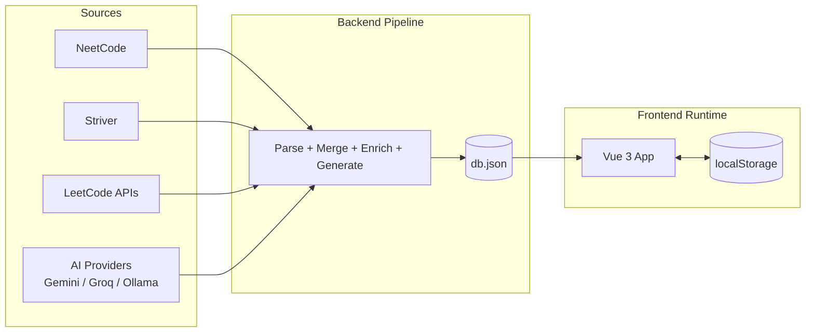
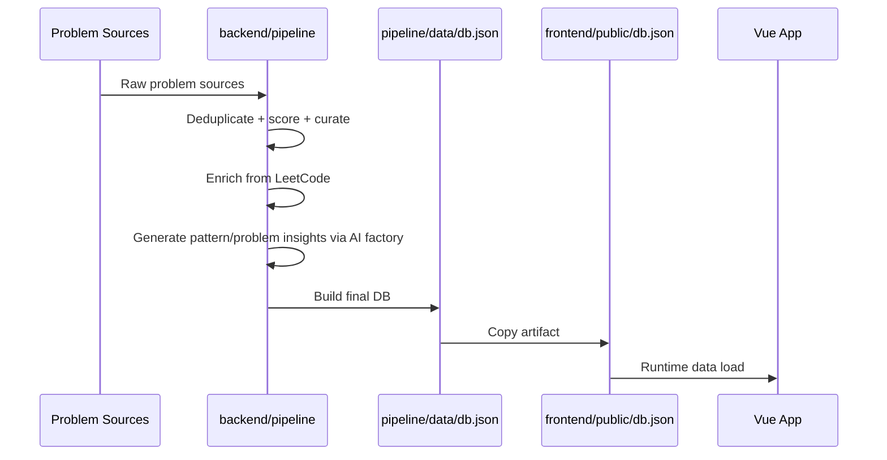

# DSA Pattern Lab

Pattern-first DSA learning app with an AI-assisted content pipeline and a static frontend runtime.

The core idea: generate high-quality learning data once, then ship a fast client-only experience.

## Table of Contents

- [0. Demo](#0-Demo)
- [1. High-Level Overview](#1-high-level-overview)
- [2. System Architecture](#2-system-architecture)
- [3. End-to-End Workflow](#3-end-to-end-workflow)
- [4. Repository Structure](#4-repository-structure)
- [5. Backend Deep Dive](#5-backend-deep-dive)
- [6. Frontend Deep Dive](#6-frontend-deep-dive)
- [7. Quick Start](#7-quick-start)
- [8. Why This Repo Is Structured This Way](#8-why-this-repo-is-structured-this-way)
- [9. Open Source Readiness Roadmap](#9-open-source-readiness-roadmap)

## 0. Demo


https://github.com/user-attachments/assets/42d27613-cdf5-4888-9132-246e09eab491


## 1. High-Level Overview

This repo has two major parts:

- `backend/`: a data pipeline that curates problems and generates learning metadata using AI providers.
- `frontend/`: a Vue app that consumes static `db.json` and runs entirely client-side (including user progress in localStorage).

Current generated dataset:

- 200 problems
- 17 patterns
- Difficulty mix: Easy 70, Medium 113, Hard 17

## 2. System Architecture



## 3. End-to-End Workflow



## 4. Repository Structure

```text
DSAPatternLearnApp/
├── backend/
│   ├── ai/                  # provider abstraction + adapters + factory
│   ├── pipeline/            # end-to-end data pipeline scripts
│   │   └── data/            # intermediate and final JSON artifacts
│   ├── requirements.txt
│   └── README.md
├── frontend/
│   ├── src/                 # Vue views/components/composables/router
│   ├── public/db.json       # backend-produced runtime data
│   └── README.md
└── project-markdowns/       # planning and internal notes
```

## 5. Backend Deep Dive

Backend docs are intentionally separated to keep this root README readable.

- Detailed backend documentation: [backend/README.md](backend/README.md)
- Includes:
  - pipeline step order and commands
  - input/output contract per script
  - AI factory behavior and provider fallback
  - explanation of each file in `backend/pipeline/`

## 6. Frontend Deep Dive

Frontend already has a comprehensive technical README:

- Detailed frontend documentation: [frontend/README.md](frontend/README.md)
- Includes:
  - route map and screen workflows
  - composable architecture
  - Smart Random logic and persistence

## 7. Quick Start

Backend pipeline:

```bash
cd backend
python -m venv venv
source venv/bin/activate
pip install -r requirements.txt

python pipeline/parse_neetcode.py
python pipeline/parse_striver.py
python pipeline/merge_and_curate.py
python pipeline/fetch_leetcode.py
python pipeline/generate_patterns.py
python pipeline/generate_problem_insights.py
python pipeline/build_final_db.py

cp pipeline/data/db.json ../frontend/public/db.json
```

Frontend app:

```bash
cd frontend
npm install
npm run dev
```

## 9. Open Source Readiness Roadmap

Baseline docs and templates now included:

- [LICENSE](LICENSE)
- [CONTRIBUTING.md](CONTRIBUTING.md)
- [CODE_OF_CONDUCT.md](CODE_OF_CONDUCT.md)
- [SECURITY.md](SECURITY.md)
- [Issue templates](.github/ISSUE_TEMPLATE)
- [PR template](.github/pull_request_template.md)
- [CODEOWNERS](.github/CODEOWNERS)
