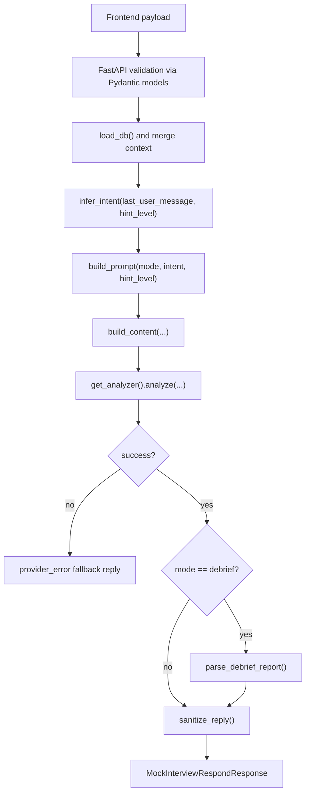

# Mock Interview Flow (Backend)

This document explains how `backend/app.py` powers the mock interview runtime endpoint and why each step exists.

## Purpose and Scope

The backend has one main responsibility for mock interview mode:

- accept structured frontend context,
- call an AI provider with bounded prompts,
- enforce interview safety constraints,
- return a normalized response payload that the frontend can always render.

The endpoint supports two modes:

1. `interview`: live, turn-by-turn interviewer responses.
2. `debrief`: end-of-session structured evaluation report.

## Entry Points

- `GET /api/health`
- `POST /api/mock-interview/respond`

`/api/health` is used for quick verification of current provider/model wiring.

`/api/mock-interview/respond` is the core path used by `frontend/src/composables/useMockInterview.ts`.

## Data Flow (End-to-End)



## Request Contract

`MockInterviewRespondRequest` is validated before business logic runs.

Important fields:

- `session_id`: correlates all calls in one interview session.
- `problem_slug`: active problem key.
- `messages`: recent transcript (frontend usually sends full local thread).
- `hint_level`: cumulative hint count for the current problem.
- `mode`: `interview` or `debrief`.
- `problem`: optional enriched context from frontend.
- `debrief_context`: only used in `debrief` mode.

## Context Merge Strategy

`build_content(...)` merges frontend problem context and local `db.json`.

Precedence (high -> low):

1. `payload.problem.*` (frontend-provided, often freshest)
2. `db['problems'][slug].*` (backend fallback)

Why this design:

- frontend may carry newly regenerated fields not present in backend local copy,
- backend still works when frontend sends minimal metadata.

## Interview Mode Behavior

### Intent Classification

`infer_intent(...)` is regex-based and intentionally lightweight.

| Intent | Trigger examples | Why it matters |
| --- | --- | --- |
| `clarification` | `clarify`, `constraint`, `assume`, `edge`, `?` | nudges assumptions and boundaries |
| `hint` | `hint`, `stuck`, `nudge`, `help`, or `hint_level > 0` | enables progressive hint posture |
| `reinforcement` | `right`, `correct`, `direction` | confirms and extends candidate reasoning |
| `guidance` | fallback | default coaching mode |

### Safety Guardrails

`sanitize_reply(...)` blocks likely full-solution leakage in `interview` mode:

- fenced code blocks ```...```
- `class Solution`
- `public static`
- `def <name>(` style signatures

If triggered, backend returns a strict non-code nudge and adds `possible_solution_leak` to `safety_flags`.

## Debrief Mode Behavior

`debrief` mode focuses on structured summary quality and context-size control.

### Context Truncation Rules

`normalize_debrief_context(...)` and helper functions enforce bounds:

- problem statement excerpt: ~900 chars per attempt,
- code excerpt: up to ~2800 chars per attempt,
- recent chat: last 12 messages per attempt,
- thoughts, notes, and reasoning lists truncated per-item/per-count,
- recommendation candidates capped (`<= 20` backend-side).

This prevents token bloat and keeps model attention on high-signal evidence.

### JSON Parsing and Validation

Debrief model output is parsed using:

1. `parse_json_object(...)`: tolerates raw JSON, fenced JSON, or wrapper prose.
2. `parse_debrief_report(...)`: validates into `DebriefReportPayload`.

If parse/validation fails:

- response still succeeds (`200`),
- `debrief` becomes `null`,
- `debrief_parse_failed` is added to `safety_flags`.

Frontend then keeps deterministic fallback scoring.

## Failure and Fallback Policy

Provider call failures do **not** break interview UX.

When `analyzer.analyze(...)` fails:

- backend returns a deterministic guidance reply,
- includes `provider_error` in `safety_flags`,
- keeps payload shape stable for frontend rendering.

## Caching and Performance

`@lru_cache(maxsize=1)` is used for:

- `load_db()`: avoids repeated disk reads,
- `get_analyzer()`: avoids rebuilding provider clients each request.

Operational note: restart backend to pick up changed env/provider config.

## Integration Points with Frontend

Primary caller:

- `frontend/src/composables/useMockInterview.ts`

Usage pattern:

1. chat turns -> `mode='interview'`
2. session finalization -> `mode='debrief'`

The frontend expects `reply`, `intent`, and optional structured `debrief` fields.

## Debugging Checklist

1. Validate service health:
   - `curl http://localhost:8000/api/health`
2. Verify `db.json` exists:
   - `backend/pipeline/data/db.json`
3. Confirm env keys for provider path (`GROQ_API_KEY`, etc.).
4. If debrief is missing, check for `debrief_parse_failed` in `safety_flags`.
5. If responses become generic, inspect whether context was truncated too aggressively.

## Extension Guidelines

When modifying this flow:

- keep response schema backward-compatible for frontend,
- preserve non-blocking fallback behavior,
- update truncation limits deliberately (token-cost implications),
- document new safety flags and intent types in this file.
