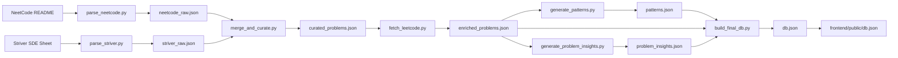

# Backend - DSA Pattern Lab

Backend in this repo is a data-generation pipeline, not a web server.

It ingests curated coding problem sources, enriches them with LeetCode metadata, generates AI learning content, and outputs a single `db.json` consumed by the Vue frontend.

## Table of Contents

- [1. What This Folder Does](#1-what-this-folder-does)
- [2. Architecture at a Glance](#2-architecture-at-a-glance)
- [3. Setup](#3-setup)
- [4. Environment Variables](#4-environment-variables)
- [5. Run the Full Pipeline](#5-run-the-full-pipeline)
- [6. Pipeline Stages and File Contracts](#6-pipeline-stages-and-file-contracts)
- [7. AI Factory (How Model Selection Works)](#7-ai-factory-how-model-selection-works)
- [8. `pipeline/` File-by-File Reference](#8-pipeline-file-by-file-reference)
- [9. Data Output Schema (Frontend Contract)](#9-data-output-schema-frontend-contract)
- [10. Regeneration and Resume Behavior](#10-regeneration-and-resume-behavior)
- [11. Troubleshooting](#11-troubleshooting)

## 1. What This Folder Does

The backend produces:

- A curated set of DSA problems (NeetCode + Striver overlap aware)
- LeetCode metadata (difficulty, acceptance, tags, description HTML)
- Pattern-level learning resources (mental models + templates)
- Problem-level learning insights (hints, key idea, mistakes, complexity)
- Final consolidated database: `pipeline/data/db.json`

No persistent backend service is required at runtime. Frontend reads static JSON.

V2 introduces an optional runtime API for Mock Interview AI chat (`backend/app.py`), which can be run locally when you want interviewer responses from Groq.

## 2. Architecture at a Glance



## 3. Setup

From repository root:

```bash
cd backend
python -m venv venv
source venv/bin/activate
pip install -r requirements.txt
cp .env.example .env
```

## 4. Environment Variables

Set these in `backend/.env`:

| Variable | Required | Used By | Notes |
| --- | --- | --- | --- |
| `GEMINI_API_KEY` | No | `generate_patterns.py` via `AIAnalyzerFactory.create_default()` | If present, default provider prefers Gemini |
| `GROQ_API_KEY` | No | `generate_problem_insights.py` and optional default fallback | Required for current problem-insight generation script |
| `DEFAULT_AI_PROVIDER` | No | Reserved config default | Present in `.env.example` for future/provider pinning workflows |
| `DEFAULT_AI_MODEL` | No | Reserved config default | Present in `.env.example` for future/model pinning workflows |
| `LEETCODE_COOKIE` | No | `fetch_leetcode.py` | Optional browser cookie string for stricter anti-bot environments |

Ollama fallback:

- If no cloud key is present, factory can use local Ollama (`ollama` package + local daemon/model).
- Default template for env file: `backend/.env.example`

## 5. Run the Full Pipeline

Run from `backend/`:

```bash
python pipeline/parse_neetcode.py
python pipeline/parse_striver.py
python pipeline/merge_and_curate.py
python pipeline/fetch_leetcode.py
python pipeline/generate_patterns.py
python pipeline/generate_problem_insights.py
python pipeline/build_final_db.py
```

Publish to frontend:

```bash
cp pipeline/data/db.json ../frontend/public/db.json
```

## Runtime API (V2 Mock Interview)

Run from `backend/`:

```bash
uvicorn app:app --reload --port 8000
```

Endpoints:

- `GET /api/health`
- `POST /api/mock-interview/respond`

The server uses `AIAnalyzerFactory` and defaults to Groq smart model when `DEFAULT_AI_PROVIDER=groq` and `DEFAULT_AI_MODEL=smart`.

## 6. Pipeline Stages and File Contracts

| Stage | Script | Input | Output |
| --- | --- | --- | --- |
| Source parse A | `parse_neetcode.py` | NeetCode GitHub README (remote) | `data/neetcode_raw.json` |
| Source parse B | `parse_striver.py` | Striver page (crawl4ai) or static fallback | `data/striver_raw.json` |
| Merge + scoring | `merge_and_curate.py` | `neetcode_raw.json`, `striver_raw.json` | `data/curated_problems.json` (top 200) |
| LC enrichment | `fetch_leetcode.py` | `curated_problems.json` + LeetCode APIs | `data/enriched_problems.json` |
| Pattern content | `generate_patterns.py` | `enriched_problems.json` + AI provider | `data/patterns.json` |
| Problem insights | `generate_problem_insights.py` | `enriched_problems.json` + AI provider | `data/problem_insights.json` |
| Final assembly | `build_final_db.py` | `patterns.json`, `enriched_problems.json`, `problem_insights.json` | `data/db.json` |

## 7. AI Factory (How Model Selection Works)

`backend/ai/` provides a provider-agnostic interface:

- `AIAnalyzerInterface`: common contract (`analyze`, `extract_json`)
- `AIResponse`: normalized result payload
- Provider adapters:
  - `GeminiAnalyzer`
  - `GroqAnalyzer`
  - `OllamaAnalyzer`
- `AIAnalyzerFactory`: creation and provider fallback

Default fallback order (`create_default()`):

1. Gemini (`GEMINI_API_KEY`)
2. Groq (`GROQ_API_KEY`)
3. Ollama (local)

Current usage pattern in pipeline:

- `generate_patterns.py` uses `create_default()` (auto-select provider)
- `generate_problem_insights.py` explicitly uses Groq smart model

## 8. `pipeline/` File-by-File Reference

| File | Purpose | Key Behavior |
| --- | --- | --- |
| `parse_neetcode.py` | Parse NeetCode README markdown table | Extracts slug, title, pattern, solution-count signal |
| `parse_striver.py` | Parse Striver SDE sheet | Uses `crawl4ai` first; falls back to static seed list |
| `merge_and_curate.py` | Merge + dedupe + score | Overlap-aware scoring, must-have boost, target `200` |
| `fetch_leetcode.py` | Fetch LC metadata | GraphQL + public bulk API fallback, retry/backoff, resume |
| `generate_patterns.py` | Generate pattern teaching docs | Produces explanations, templates, triggers, walkthrough |
| `generate_problem_insights.py` | Generate per-problem insights | Batches 5 per call, delay for TPM control, resume-safe |
| `build_final_db.py` | Build frontend-ready DB | Merges all artifacts and emits canonical `db.json` |
| `data/` | Pipeline artifacts | Intermediate + final datasets |

## 9. Data Output Schema (Frontend Contract)

Final `db.json` top-level:

- `patterns`: pattern documents with `problem_slugs`
- `problems`: slug-indexed problem dictionary
- `pattern_order`: recommended learning sequence
- `meta`: totals and difficulty distribution

From current generated data (`pipeline/data/db.json`):

- `total_problems`: `200`
- `total_patterns`: `17`
- `difficulty_distribution`: `Easy 70`, `Medium 113`, `Hard 17`

## 10. Regeneration and Resume Behavior

Resume-safe scripts:

- `fetch_leetcode.py`: skips already enriched slugs
- `generate_patterns.py`: skips already generated successful patterns
- `generate_problem_insights.py`: skips already generated successful insights

Practical regeneration patterns:

- Full rebuild: rerun all steps in order
- Refresh only AI pattern docs: rerun `generate_patterns.py` + `build_final_db.py`
- Refresh only problem insights: rerun `generate_problem_insights.py` + `build_final_db.py`

## 11. Troubleshooting

- `ModuleNotFoundError: ai`:
  - Run scripts from `backend/` directory, not repo root.
- LeetCode GraphQL blocked (`403`/`499`):
  - Set `LEETCODE_COOKIE`, script will still attempt bulk API fallback.
- Striver crawl returns too little:
  - Script auto-falls back to static seed when extraction is below threshold.
- AI rate-limit issues:
  - Keep batch delay in `generate_problem_insights.py` and avoid parallel runs.
- Missing final data in UI:
  - Ensure `pipeline/data/db.json` is copied to `frontend/public/db.json`.
