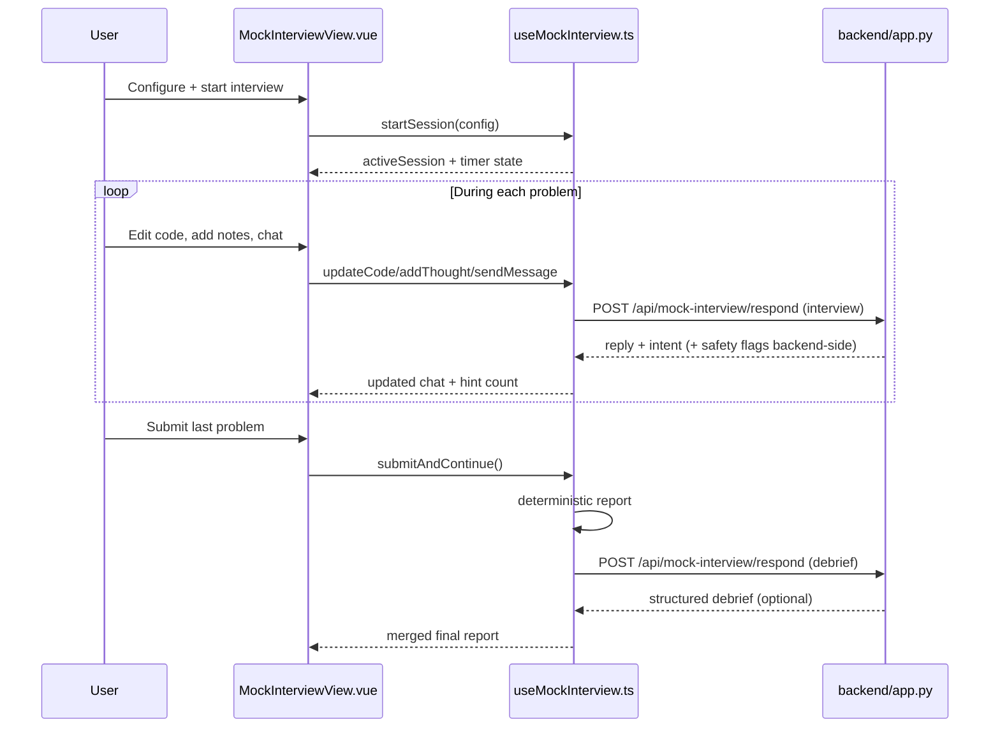

# Mock Interview Flow (Frontend)

This document explains how the frontend mock interview system works across state management, UI orchestration, scoring, and backend integration.

Core files:

- `frontend/src/composables/useMockInterview.ts` (state + logic)
- `frontend/src/views/MockInterviewView.vue` (UI wiring)
- `frontend/src/types/index.ts` (session/result contracts)

## Feature Goals

The interview feature is designed to simulate realistic pressure while staying resilient offline.

Key goals:

- timed multi-question workflow,
- progressive interviewer chat hints,
- deterministic scoring that works without network,
- optional AI debrief overlay for personalized feedback,
- full local persistence so refresh does not lose progress.

## Runtime Architecture

## Session Lifecycle

Session state lives in `activeSession` and is persisted in localStorage.

Status transitions:

1. no session (`null`) -> setup screen,
2. `active` -> timer/workspace,
3. `completed` or `abandoned` -> final report view.

`resumeIfNeeded()` rehydrates timer state on reload or tab visibility return.

## Question Selection Policy

Implemented in `selectQuestions()` + `buildSelectionWeight()`.

Constraints:

- interview pool defaults to `Easy` + `Medium`,
- session target is effectively 3 questions (or 1 in deep-link single mode),
- at most one easy question in normal selection.

Weight signals (higher means more likely):

| Signal | Weight impact |
| --- | --- |
| unsolved | `+75` |
| solved confidence 1 | `+45` |
| solved confidence 2 | `+24` |
| solved confidence 3 | `+8` |
| medium difficulty | `+18` |
| appears in both sources | `+8` |
| solved very recently | `-40 / -22 / -8` |
| recently used in mock interviews | up to `-30` |
| same pattern already selected this session | `-22` |
| diversity jitter | `+ random(0..10)` |

Selection uses weighted roulette via `weightedPick()`.

## Timer Model

Timer is wall-clock delta based, not naive decrement-by-1.

Why:

- browser tab throttling makes interval timing unreliable,
- wall-clock reconciliation keeps elapsed time accurate after tab sleep or focus changes.

Functions involved:

- `startTimer()`
- `refreshElapsedTime()`
- `togglePause()`
- `resumeIfNeeded()`

## Chat and Hint Flow

`sendMessage()` behavior:

1. append user chat locally,
2. detect hint intent (`isHintRequest`) and increment `hintCount`,
3. call backend when `aiEnabled=true`,
4. fallback to `buildOfflineReply(...)` on any API failure,
5. append assistant reply and persist.

Offline fallback uses a hint ladder:

- level 1: frame problem contract,
- level 2: pattern/data-structure nudge,
- level 3+: strategic high-level guidance.

This guarantees uninterrupted session flow even when backend/provider is down.

## Deterministic Scoring (Phase 1)

`computeProblemResult()` calculates per-problem score out of 100 using rubric components:

- understanding (`0..20`)
- approach (`0..25`)
- correctness confidence (`0..25`)
- complexity reasoning (`0..15`)
- communication (`0..15`)

Signals used:

- submission presence,
- thought-note verbosity,
- user message count,
- code line count,
- complexity mentions,
- edge-case/test mentions,
- hint usage penalties.

`buildHeuristicSessionResult()` then computes:

- total score (average + consistency bonus),
- strengths/weaknesses,
- weak-pattern inference,
- recommended follow-up problems.

## AI Debrief Overlay (Phase 2)

`enhanceReportWithAI()` sends bounded evidence payload:

- per-problem code excerpt,
- recent chat slice,
- thought notes,
- stored notes from progress state,
- deterministic heuristic score + reasoning,
- candidate recommendation slugs.

`normalizeAIDebriefResult()` overlays AI results onto fallback report with strict guards:

- invalid or missing AI fields fall back to deterministic values,
- recommended slugs are filtered to known problems,
- per-problem merge is slug-by-slug and optional.

Result: users always get immediate report, plus richer feedback when AI succeeds.

## Deep-Link Behavior

From problem page, interview mode can be launched with query params:

- `slug=<problem-slug>`
- `autostart=1`
- `single=1`

`MockInterviewView.vue` watches these params and:

- resets existing active session if needed,
- starts a fresh interview anchored to that slug,
- clears query after start to avoid repeat triggers.

## Persistence Keys

- `dsa-mock-interview-sessions`
- `dsa-mock-interview-recent-slugs`
- `dsa-mock-interview-flags`

These keys are managed only by the composable to keep storage shape centralized.

## Debugging Checklist

1. Confirm dataset loaded (`usePatterns` has problems).
2. Verify session exists in localStorage and schema looks valid.
3. Check `featureFlags.aiEnabled` state.
4. Inspect network call to `/api/mock-interview/respond`.
5. If report stays heuristic-only, backend likely returned no parseable debrief.

## Change Safety Notes

When editing this feature:

- keep `MockInterviewSession` schema backward-compatible where possible,
- avoid moving business logic into the view,
- ensure offline fallback remains functional,
- preserve deterministic report path as primary reliability layer.
