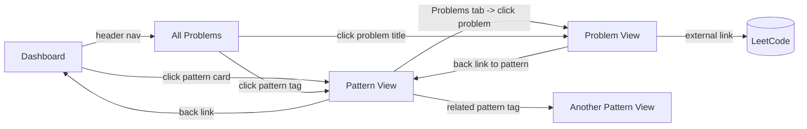
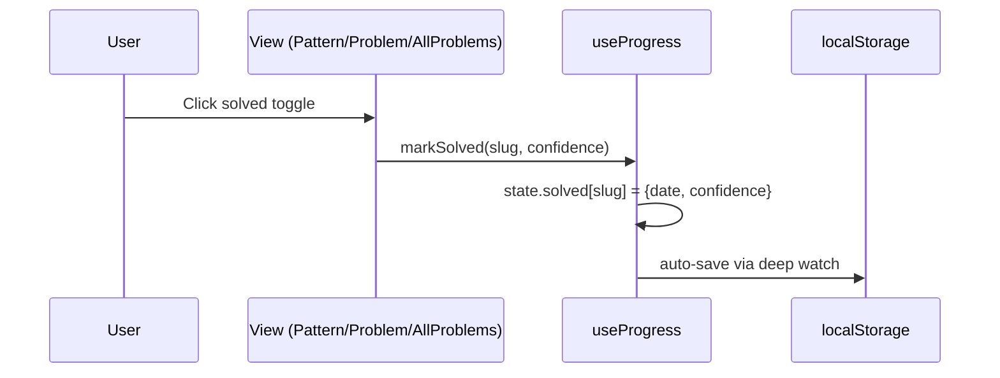
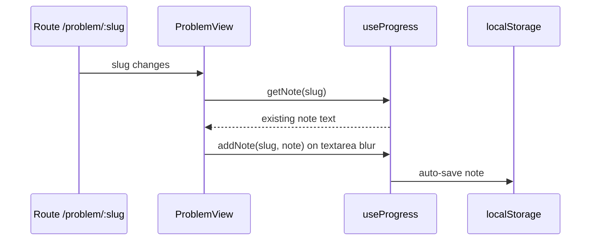
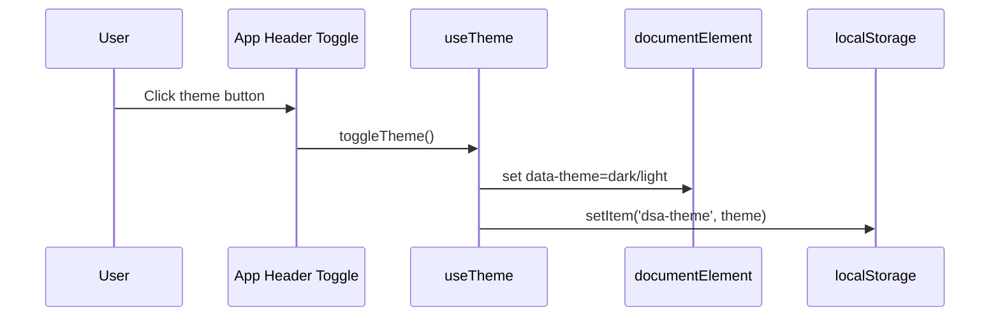

# DSA Pattern Lab Frontend

A Vue 3 + TypeScript + Vite frontend for learning DSA through pattern-based practice.

This guide explains how this folder is organized, how views/composables connect, how `db.json` is consumed, and how user progress/preferences persist.

## 1) Quick Start

| Task | Command | Notes |
|---|---|---|
| Install deps | `npm install` | Creates `node_modules/` |
| Run dev server | `npm run dev` | Opens Vite app (usually `http://localhost:5173`) |
| Build production | `npm run build` | Type-check + Vite bundle |
| Preview build | `npm run preview` | Serves `dist/` output |

## 2) Folder Navigation Map

```text
frontend/
├── public/
│   ├── db.json                # Main dataset: patterns + problems + metadata
│   └── vite.svg
├── src/
│   ├── App.vue                # Global layout (header/nav/footer + router-view)
│   ├── main.ts                # App bootstrap (createApp + router)
│   ├── style.css              # Global design system and utility classes
│   ├── router/
│   │   └── index.ts           # Route definitions + dynamic page titles
│   ├── composables/
│   │   ├── usePatterns.ts     # Data loading/querying from db.json
│   │   ├── useProgress.ts     # Solved state, notes, confidence, review schedule
│   │   └── useTheme.ts        # Dark/light theme persistence
│   ├── views/
│   │   ├── DashboardView.vue  # Pattern dashboard and progress summary
│   │   ├── PatternView.vue    # Pattern details + template + pattern problems
│   │   ├── ProblemView.vue    # Individual problem page + notes/confidence
│   │   └── AllProblemsView.vue# Search/filter/sort across all problems
│   ├── types/
│   │   └── index.ts           # Type contracts for DB and local progress
│   └── components/
│       └── HelloWorld.vue     # Template artifact (currently unused)
├── index.html
├── package.json
└── README.md
```

## 3) High-Level Architecture

```mermaid
flowchart TD
    A[main.ts] --> B[App.vue]
    B --> C[Vue Router]

    C --> D[/]
    C --> E[/pattern/:id]
    C --> F[/problem/:slug]
    C --> G[/problems]

    D --> H[DashboardView]
    E --> I[PatternView]
    F --> J[ProblemView]
    G --> K[AllProblemsView]

    H --> L[usePatterns]
    H --> M[useProgress]

    I --> L
    I --> M

    J --> L
    J --> M

    K --> L
    K --> M

    B --> N[useTheme]

    L --> O[public/db.json]
    M --> P[localStorage:dsa-pattern-progress]
    N --> Q[localStorage:dsa-theme]
```

## 4) Route and Navigation Behavior

| Route | View | Param | How user gets there | Primary purpose |
|---|---|---|---|---|
| `/` | `DashboardView` | none | Header nav/logo | Overall progress + pattern cards |
| `/pattern/:id` | `PatternView` | `id` = `pattern_id` | Click a pattern card/tag | Study one pattern (overview/template/problems tab) |
| `/problem/:slug` | `ProblemView` | `slug` = problem slug | From pattern/all-problems table | Work on one specific problem |
| `/problems` | `AllProblemsView` | none | Header nav | Global searchable/filterable problem index |

Extra behavior from `src/router/index.ts`:
- Uses `createWebHistory()`.
- Restores scroll position on back/forward; otherwise scrolls to top.
- Sets document title as `<Route Meta Title> · DSA Pattern Lab`.

## 5) View-to-View User Journey



## 6) Composables: What They Do and How They Interact

### `usePatterns.ts` (data access layer)

| Concern | Implementation |
|---|---|
| Data source | Fetches `GET /db.json` from `public/db.json` |
| Shared cache | Module-level `db`, `loaded`, `loading`, `error` refs |
| Primary outputs | `patterns`, `problems`, `patternOrder`, `meta`, `loading`, `error` |
| Query helpers | `getPattern(id)`, `getProblemsForPattern(patternId)`, `getAllProblems()` |

Important details:
- `loaded` is module-scoped, so all views share one dataset instance.
- `pattern_order` is exposed as `patternOrder` but currently not used directly by views.
- `error` is produced on fetch failure, but no view currently renders an error UI.

### `useProgress.ts` (learning state + persistence)

| Concern | Implementation |
|---|---|
| Local storage key | `dsa-pattern-progress` |
| In-memory state | Reactive object: `{ solved, notes, reflections }` |
| Auto-save | Deep `watch` persists every state change |
| Solved tracking | `markSolved(slug, confidence)`, `unmarkSolved(slug)`, `isSolved(slug)` |
| Confidence | `getConfidence(slug)` and confidence setter via `markSolved` |
| Notes | `addNote(slug, note)`, `getNote(slug)` |
| Review queue | `getDueForReview()` using confidence-based intervals |
| Progress metrics | `totalSolved`, `patternCompletion(slugs)` |
| Import/export | `exportProgress()`, `importProgress(json)` |

Spaced repetition intervals:

| Confidence | Meaning | Review interval |
|---|---|---|
| `1` | Shaky | 1 day |
| `2` | Okay | 3 days |
| `3` | Solid | 7 days |

### `useTheme.ts` (UI preference)

| Concern | Implementation |
|---|---|
| Local storage key | `dsa-theme` |
| Allowed values | `'dark'` \| `'light'` |
| DOM sync | Sets `data-theme` on `document.documentElement` |
| Public API | `theme`, `toggleTheme()` |

## 7) Data Source: `public/db.json`

Top-level shape:

| Key | Type | Purpose |
|---|---|---|
| `patterns` | `Pattern[]` | Pattern content, templates, and problem slug lists |
| `problems` | `Record<string, Problem>` | Problem details keyed by slug |
| `pattern_order` | `string[]` | Canonical learning order by `pattern_id` |
| `meta` | object | Aggregate counts and difficulty distribution |

Current dataset snapshot:

| Metric | Value |
|---|---|
| Total patterns | `17` |
| Total problems | `200` |
| Difficulty split | Easy `70`, Medium `113`, Hard `17` |

## 8) Type Contracts (`src/types/index.ts`)

### `Pattern`

| Key examples | Meaning |
|---|---|
| `pattern_id`, `name` | Identity and display |
| `mental_model`, `explanation` | Conceptual learning content |
| `template_code_python/javascript/java` | Multi-language starter templates |
| `trigger_phrases`, `when_to_use`, `common_mistakes` | Pattern heuristics |
| `problem_slugs`, `problem_count` | Links pattern to its problems |
| `related_patterns` | Graph-like relationship between patterns |

### `Problem`

| Key examples | Meaning |
|---|---|
| `slug`, `title`, `number`, `leetcode_url` | Core identification |
| `difficulty`, `acceptance_rate` | Difficulty metadata |
| `pattern_id`, `pattern_name` | Parent pattern mapping |
| `pattern_hint`, `key_insight`, `template_deviation`, `common_mistake` | Learning annotations |
| `time_complexity`, `space_complexity`, `topic_tags` | Study and recall helpers |

### `Progress`

| Bucket | Stored data |
|---|---|
| `solved[slug]` | `{ date, confidence }` |
| `notes[slug]` | Free-text notes |
| `reflections[slug]` | `{ pattern, signal, deviation }` (ready for future UI) |

## 9) Interaction and Persistence Flows

### A) Marking a problem as solved



### B) Notes lifecycle on problem page



### C) Theme preference lifecycle



## 10) Screen-by-Screen Behavior

| View | Reads from composables | Writes to composables | UI responsibilities |
|---|---|---|---|
| `DashboardView` | `patterns`, `meta`, `totalSolved`, `patternCompletion`, `getDueForReview()` | none | Pattern grid, overall completion ring, sort modes |
| `PatternView` | `getPattern`, `getProblemsForPattern`, `isSolved`, `patternCompletion` | `markSolved`, `unmarkSolved` | Pattern learning tabs + per-problem solved toggles |
| `ProblemView` | `problems`, `isSolved`, `getConfidence`, `getNote` | `markSolved`, `unmarkSolved`, `addNote` | Problem insights, confidence controls, notes |
| `AllProblemsView` | `getAllProblems`, `patterns`, `isSolved` | `markSolved`, `unmarkSolved` | Search/filter/sort table and quick status toggles |
| `App.vue` | `meta`, `totalSolved`, `theme` | `toggleTheme` | Shared shell, top nav, global counters, theme switch |

## 11) Design System and Theming

Global styling is centralized in `src/style.css`:
- CSS variables for spacing, typography, radii, transitions.
- Two theme palettes keyed by `[data-theme="dark"]` and `[data-theme="light"]`.
- Shared utility classes (`.container`, `.badge`, `.card`, `.btn`, transitions, etc.).

Theme is controlled entirely by `useTheme()` and persisted in `localStorage`.

## 12) Practical Development Notes

| Topic | Guidance |
|---|---|
| Add/update problems | Edit `public/db.json` and keep fields consistent with `Problem` type |
| Add new pattern | Add pattern object + slugs + `pattern_order` + update `meta` counts if needed |
| New route/view | Register route in `src/router/index.ts`, create view in `src/views/`, wire links |
| New shared state | Prefer adding a composable (module-level state if global sharing is needed) |
| Unused artifacts | `src/components/HelloWorld.vue` and `highlight.js` dependency are currently unused |

## 13) Caveats and Extension Points

- `usePatterns` exposes `error`, but no dedicated error UI is rendered yet.
- `markSolved` updates the `date` each time (including confidence changes), which resets review timing.
- `reflections` support exists in `useProgress`, but no current screen uses it.
- `importProgress()` uses `Object.assign(state, imported)` and assumes compatible structure.

## 14) Suggested Next Improvements

1. Add explicit loading/error/empty-state patterns that include `usePatterns.error`.
2. Add a Progress Settings page for import/export/reset and review queue management.
3. Use `pattern_order` explicitly in dashboard sorting as a canonical fallback.
4. Add schema validation for `db.json` at build time.

---

If you are onboarding: start with `src/App.vue`, then `src/router/index.ts`, then `src/composables/usePatterns.ts` and `src/composables/useProgress.ts`, and finally the `src/views/*.vue` pages.
