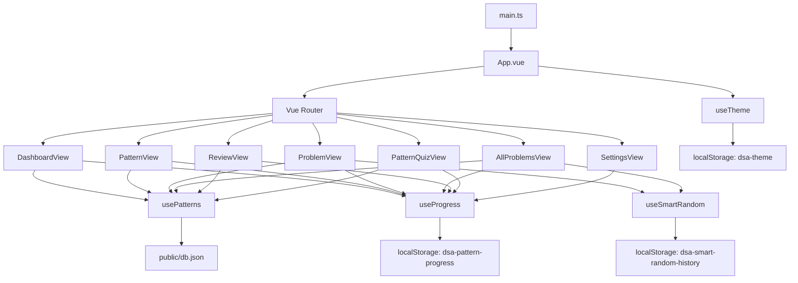
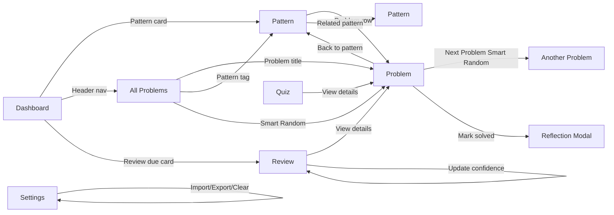
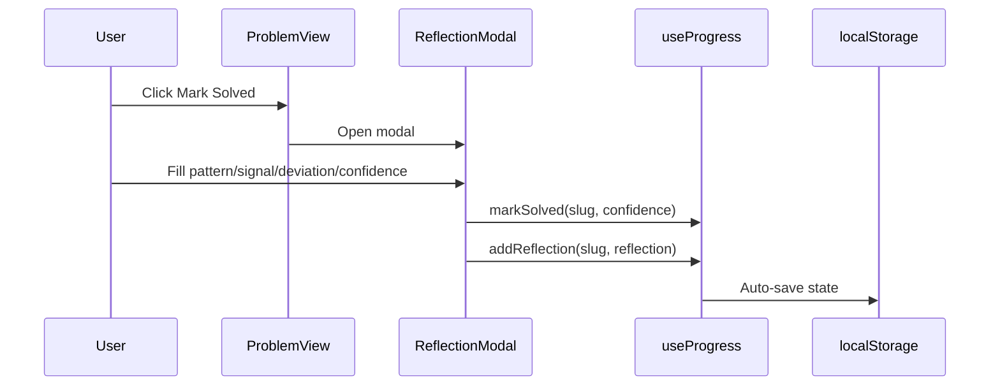
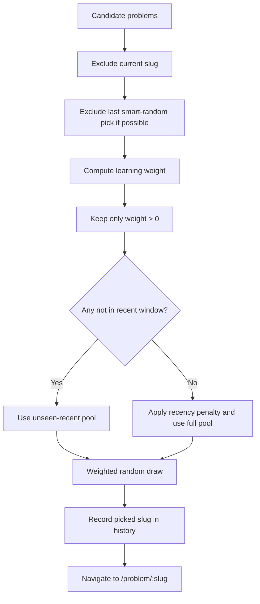

# DSA Pattern Lab Frontend

A Vue 3 + TypeScript + Vite frontend for pattern-first DSA learning.

This README is a detailed technical guide for this folder: architecture, navigation, data flow, composables, feature workflows, and Smart Random internals.

## 1) What Changed In This Branch

| Area                | Change                                                                       |
| ------------------- | ---------------------------------------------------------------------------- |
| Navigation          | Added routes and header links for `Review`, `Quiz`, and `Settings`     |
| Smart selection     | Added `useSmartRandom.ts` and Smart Random actions in problem list/detail  |
| Reflection workflow | Added `ReflectionModal.vue` and solve-time reflection capture              |
| Review system       | Added `ReviewView.vue` with spaced-repetition queue and confidence updates |
| Quiz system         | Added `PatternQuizView.vue` for pattern identification practice            |
| Settings            | Added `SettingsView.vue` for export/import/clear local progress            |
| Code templates      | Added `CodeHighlight.vue` with `highlight.js` syntax highlighting        |
| Problem list UX     | Added bridge filter and Smart Random button in All Problems view             |

## 2) Quick Start

| Task                     | Command             |
| ------------------------ | ------------------- |
| Install dependencies     | `npm install`     |
| Start dev server         | `npm run dev`     |
| Build production         | `npm run build`   |
| Preview production build | `npm run preview` |

## 3) Folder Map

```text
frontend/
├── public/
│   ├── db.json
│   └── vite.svg
├── src/
│   ├── App.vue
│   ├── main.ts
│   ├── style.css
│   ├── router/
│   │   └── index.ts
│   ├── composables/
│   │   ├── usePatterns.ts
│   │   ├── useProgress.ts
│   │   ├── useTheme.ts
│   │   └── useSmartRandom.ts
│   ├── components/
│   │   ├── CodeHighlight.vue
│   │   └── ReflectionModal.vue
│   ├── views/
│   │   ├── DashboardView.vue
│   │   ├── PatternView.vue
│   │   ├── ProblemView.vue
│   │   ├── AllProblemsView.vue
│   │   ├── ReviewView.vue
│   │   ├── PatternQuizView.vue
│   │   └── SettingsView.vue
│   └── types/
│       └── index.ts
├── package.json
└── README.md
```

## 4) Route Map

| Route              | View                | Purpose                                                      |
| ------------------ | ------------------- | ------------------------------------------------------------ |
| `/`              | `DashboardView`   | Pattern dashboard + macro progress                           |
| `/pattern/:id`   | `PatternView`     | Pattern overview, templates, and problem list                |
| `/problem/:slug` | `ProblemView`     | Problem details, solving, notes, reflection, next smart pick |
| `/problems`      | `AllProblemsView` | Search/filter/sort all problems + bridge + smart random      |
| `/review`        | `ReviewView`      | Spaced repetition queue                                      |
| `/quiz`          | `PatternQuizView` | Pattern recognition training mode                            |
| `/settings`      | `SettingsView`    | Backup/restore/clear progress data                           |

Router behavior (`src/router/index.ts`):

- Uses `createWebHistory()`.
- Restores scroll position on browser back/forward.
- Updates document title to `<Route> · DSA Pattern Lab`.

## 5) High-Level Architecture



## 6) Screen Navigation Workflows



## 7) Core Composables

### `usePatterns.ts`

| Responsibility | Notes                                                                          |
| -------------- | ------------------------------------------------------------------------------ |
| Load dataset   | Fetches `/db.json` once using module-level cache (`loaded`)                |
| Expose data    | `patterns`, `problems`, `patternOrder`, `meta`, `loading`, `error` |
| Query helpers  | `getPattern`, `getProblemsForPattern`, `getAllProblems`                  |

### `useProgress.ts`

| Responsibility         | Notes                                                                          |
| ---------------------- | ------------------------------------------------------------------------------ |
| Persist learning state | Uses reactive `state` + deep watch to save in localStorage                   |
| Storage key            | `dsa-pattern-progress`                                                       |
| Solved API             | `markSolved`, `unmarkSolved`, `isSolved`, `getConfidence`              |
| Notes API              | `addNote`, `getNote`                                                       |
| Reflection API         | `addReflection`, `getReflection`                                           |
| Review logic           | `getDueForReview()` by confidence intervals: 1d / 3d / 7d                    |
| Progress utilities     | `totalSolved`, `patternCompletion`, `exportProgress`, `importProgress` |

### `useTheme.ts`

| Responsibility   | Notes                                         |
| ---------------- | --------------------------------------------- |
| Theme preference | Dark/light toggle                             |
| Storage key      | `dsa-theme`                                 |
| DOM integration  | Sets `document.documentElement[data-theme]` |

### `useSmartRandom.ts`

| Responsibility          | Notes                                                                  |
| ----------------------- | ---------------------------------------------------------------------- |
| Weighted recommendation | Computes learning-aware weights per candidate problem                  |
| Duplicate prevention    | Tracks recent picks and avoids immediate/recent repeats                |
| Navigation helper       | `navigateSmartRandom(excludeSlug?)` pushes to selected problem route |
| Storage key             | `dsa-smart-random-history`                                           |

## 8) Detailed Feature Workflows

### 8.1 Solve + Reflection Workflow

When user clicks `Mark Solved` in `ProblemView`:

1. Reflection modal opens (instead of immediate solve).
2. User completes 4-step reflection.
3. On submit: `markSolved(slug, confidence)` + `addReflection(slug, {...})`.
4. Progress auto-persists in localStorage via `useProgress` deep watch.



### 8.2 Review Queue Workflow (`/review`)

1. `getDueForReview()` computes due slugs from solved dates + confidence intervals.
2. View maps slugs to problems and sorts by lowest confidence first.
3. User can update confidence quickly (`😟`, `😐`, `😎`) which refreshes solve date and confidence.

### 8.3 Quiz Workflow (`/quiz`)

1. Random problem chosen from opti	onal pattern-filtered pool.
2. User guesses pattern.
3. Reveal computes fuzzy correctness and updates session score/history.
4. User jumps to problem detail or next quiz item.

### 8.4 Settings Workflow (`/settings`)

- Export: serializes progress state into downloadable JSON file.
- Import: accepts pasted/file JSON and merges into current state.
- Clear: deletes solved/notes/reflections in place.

## 9) Smart Random Deep Dive

### 9.1 Why it is “smart” instead of plain random

Plain random ignores learning context. Smart Random uses weighted sampling based on:

- current mastery,
- confidence history,
- pattern progression,
- momentum and stale gaps,
- high-value bridge problems,
- diversity constraints (recent-pick avoidance).

### 9.2 Weight model (current implementation)

| Factor              | Condition                                   | Weight impact     |
| ------------------- | ------------------------------------------- | ----------------- |
| Unsolved base       | problem not solved                          | `+100`          |
| Solved resurfacing  | confidence `1`                            | `+40`           |
| Solved resurfacing  | confidence `2`                            | `+10`           |
| Solid solved        | confidence `3`                            | excluded (`0`)  |
| Difficulty ladder   | early pattern progress + Easy               | `+30`           |
| Difficulty ladder   | mid progress + Medium                       | `+25`           |
| Difficulty ladder   | late progress + Hard                        | `+20`           |
| Pattern momentum    | solved in pattern within 24h                | `+20`           |
| Pattern momentum    | solved in pattern within 72h                | `+10`           |
| Stale-pattern nudge | no solved in pattern and candidate unsolved | `+15`           |
| Bridge bonus        | `in_both === true`                        | `+10`           |
| Jitter              | always                                      | `+0..15` random |

### 9.3 Duplicate prevention strategy

| Layer                     | Behavior                                                                       | Result                                |
| ------------------------- | ------------------------------------------------------------------------------ | ------------------------------------- |
| Current-problem exclusion | `excludeSlug` (e.g. ProblemView “Next Problem”) is filtered out            | Prevents same-page immediate repeat   |
| Last-pick hard block      | Most recent smart-random slug is blocked when alternatives exist               | Prevents back-to-back duplicate picks |
| Recent-window freshness   | Recently picked slugs (window up to 12) are excluded while fresh options exist | Strong short-term variety             |
| Graceful fallback         | If pool exhausted, recent items are reintroduced with recency penalty          | Avoids dead-ends in small pools       |
| Persistent history        | Recent picks saved in `dsa-smart-random-history` (max 40)                    | Variety survives page reloads         |

### 9.4 Selection flow



## 10) Data Contracts and Storage

### Dataset (`public/db.json`)

| Top-level key     | Type                        | Purpose                                  |
| ----------------- | --------------------------- | ---------------------------------------- |
| `patterns`      | `Pattern[]`               | Pattern content and linked problem slugs |
| `problems`      | `Record<string, Problem>` | Problem detail records keyed by slug     |
| `pattern_order` | `string[]`                | Canonical pattern progression order      |
| `meta`          | object                      | Total counts and difficulty distribution |

Current snapshot:

- `17` patterns
- `200` problems
- Difficulty split: `Easy 70`, `Medium 113`, `Hard 17`

### Type files (`src/types/index.ts`)

| Interface    | Key fields                                                                      |
| ------------ | ------------------------------------------------------------------------------- |
| `Pattern`  | identity, explanation, templates, triggers, mistakes, walkthrough, linked slugs |
| `Problem`  | metadata, pattern mapping, insights, complexity, tags, source flags             |
| `Progress` | `solved`, `notes`, `reflections`                                          |
| `Database` | `patterns`, `problems`, `pattern_order`, `meta`                         |

### localStorage keys

| Key                          | Written by         | Contents                                    |
| ---------------------------- | ------------------ | ------------------------------------------- |
| `dsa-pattern-progress`     | `useProgress`    | solved dates/confidence, notes, reflections |
| `dsa-theme`                | `useTheme`       | `'dark'` or `'light'`                   |
| `dsa-smart-random-history` | `useSmartRandom` | recent picked problem slugs                 |

## 11) View-Level Responsibilities

| View                | Reads                                               | Writes                                                       |
| ------------------- | --------------------------------------------------- | ------------------------------------------------------------ |
| `DashboardView`   | patterns/meta/progress/review due                   | none                                                         |
| `PatternView`     | pattern + pattern problems + solved status          | mark/unmark solved                                           |
| `ProblemView`     | problem details + solved/confidence/note/reflection | mark/unmark solved, notes, reflection, smart random navigate |
| `AllProblemsView` | all problems + filters + solved status              | mark/unmark solved, smart random navigate                    |
| `ReviewView`      | due problems + confidence/reflections               | confidence updates via `markSolved`                        |
| `PatternQuizView` | random problems + solved status                     | quiz session score/history (in-memory only)                  |
| `SettingsView`    | progress state                                      | export/import/clear progress                                 |

## 12) Practical Notes For Future Changes

1. If you add new learning signals, extend `getSmartWeight()` in `useSmartRandom.ts` and document each weight.
2. If you add new persisted preference/state, define a clear localStorage key and migration strategy.
3. If you modify `db.json` schema, update `src/types/index.ts` first to keep type safety tight.
4. If you alter review intervals, keep `useProgress.getDueForReview()` and README docs in sync.

## 13) Onboarding Order For New Contributors

1. `src/App.vue` (app shell + nav)
2. `src/router/index.ts` (route surface)
3. `src/composables/usePatterns.ts` and `src/composables/useProgress.ts`
4. `src/composables/useSmartRandom.ts`
5. `src/views/*` and `src/components/*`
